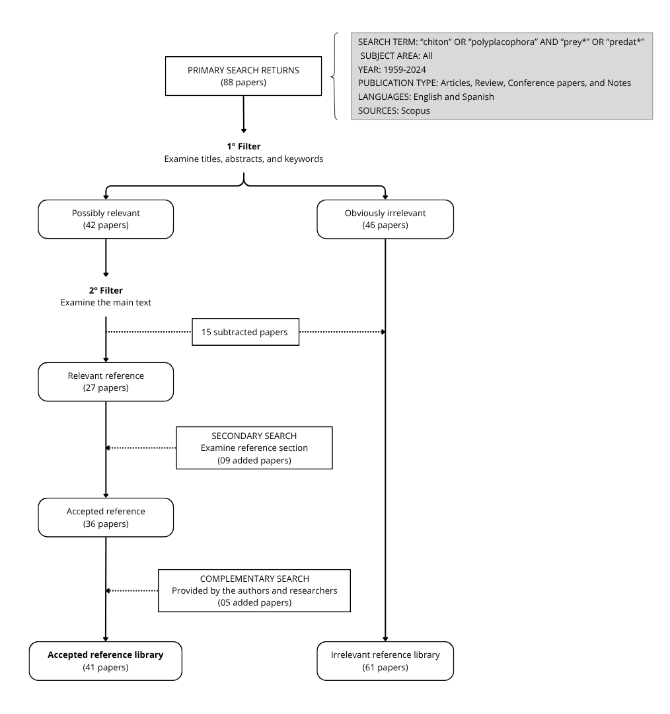
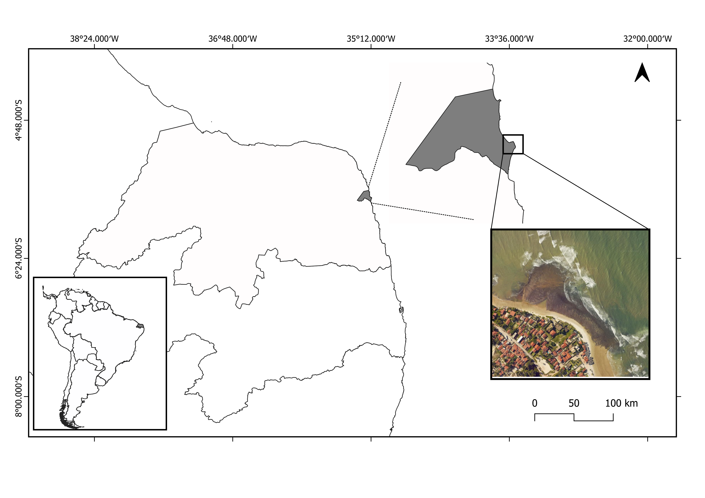

```{r setup, include=FALSE}
knitr::opts_chunk$set(echo = TRUE,
                      warning = FALSE,
                      message = FALSE)

```

**TITLE:** WHO PREYS ON CHITONS? CHITON PREDATORS AND A NEW CASE TO THE BRAZILIAN REEF OCTOPUS 

**AUTHORS AND AFFILIATIONS:** 

Guido G Grimaldi*
(Orchid: 0000-0002-6947-1957).
Postgraduate Program in Ecology at the Federal University of Santa Catarina, Florianopolis, Santa Catarina, Brazil, 88040-970.
guidogrimaldi@gmail.com.

Raiane dos Santos Guidi.
(Orchid: 0000-0002-4901-5022).
Laboratory of Sensory Ecology, Department of Physiology and Behavior, Federal University of Rio Grande do Norte, Natal, Rio Grande do Norte, Brazil, 59064-741. raianeguidi_13@hotmail.com.

Eduardo de Oliveira Bastos
(Orchid: 0000-0001-6710-7281).
Phycology Laboratory, Department of Botany, Biological Science Center, Federal University of Santa Catarina, Florianópolis, Santa Catarina, Brazil,  88040-535.
bastos_e@hotmail.com.

Paula Spotorno
(Orchid: 0000-0001-7771-3402).
Center for Computational Sciences, Federal University of Rio Grande, Rio Grande, Rio Grande do Sul, Brazil, 96203-900.
paula.spotorno@gmail.com.

Jaime A Jardim
(Orchid: 0000-0002-5511-7172).
Oceanographic Institute, Department of Biological Oceanography, University of São Paulo, São Paulo, Brazil, 05508-120.
jardim.jaime@gmail.com.

Tatiana Silva Leite
(Orchid: 000-0001-9117-9648).
Department of Ecology and Zoology, Biological Science Center, Federal University of Santa Catarina, Florianópolis, Santa Catarina, Brazil, 88040-970.
tati.polvo@gmail.com.

Daniel Marques Almeida Pessoa
(Orchid: 0000-0002-2516-6766)
Department Physiology and Animal Behavior, Federal University of Rio Grande do Norte, Natal, Rio Grande do Norte, Brazil, 59064-741.
daniel.pessoa@ufrn.br.

Paulo Antunes Horta
(Orchid: 0000-0001-7699-7589).
Department of Botany, Biological Science Center, Federal University of Santa Catarina, Florianópolis, Santa Catarina, Brazil, 88040-535
pauloantuneshorta@gmail.com.

***Corresponding author:** Guido Grimaldi (guidogrimaldi@gmail.com).

# ABSTRACT

Considering the importance of ecological relationships for determining evolutionary processes, relationships between herbivores, primary consumers and their predators play a key role. Among oldest invertebrate groups, chitons are eight-plated mollusks that have thrived in marine ecosystems for over 540 million years, playing a key role in regulating algal and invertebrate populations. Despite their long evolutionary history and ecological importance, they remain largely unknown to the general public, and information on their predators is notably scarce - even in major invertebrate biology textbooks. Here, we review the scientific literature to identify the main taxonomic groups that prey on chitons, describing predator-prey species interactions and the methods used to identify them. We also report the first field record of a juvenile Brazilian reef octopus (*Octopus insularis*) preying on the endemic West Atlantic chiton *Ischnoplax pectinata*, a previously undocumented interaction. Our survey reveals a wide range of vertebrate and invertebrate predators, including mammals, birds, fishes, crustaceans, echinoderms, mollusks, and polychaetes. However, most records were derived from indirect evidences or experiments settings, with few direct observation in natural habitats. While dietary analyses offer valuable insights into predator-prey relationships, methodological limitations require a multi-faceted approach—including natural history observations—to more accurately assess the chiton ecological role and avoid misrepresenting their trophic significance. Understanding predator-prey relationships is critical for mapping trophic interactions and food web dynamics, including energy flow and nutrient cycling. These insights can inform more accurate ecological models and support effective conservation and restoration efforts.

**KEYWORDS:** Borehole, Boulders, Cephalopoda, Drill hole, Intertidal reefs, *Ischnoplax pectinata*, Mollusca, Polyplacophora.

# INTRODUCTION

Few experiences in nature are as harrowing as being preyed upon. Predators have evolved an extraordinary variety of tools - claws to grasp, fangs to tear, beaks to pierce, and appendages or chelae to crush — in order to capture and kill their prey. In response, prey have developed an impressive array of defensive adaptations - metabolic, morphological, and behavioral - that help them avoid being attacked or killed [@crowell2024; @barnett2025]. These defenses include toxins, shells, spines, stingers, aposematic or cryptic coloration, and behaviors such as mimicking inedible object (e.g. sticks, leaves, seaweed, or bird-droppings) or employing escape responses such as alarm calls, thanatosis, or startle responses [@ruxton2018; @yamamoto2023]. Predator and prey species are so deeply intertwined that their relationship often evolves through coevolution or an evolutionary arms race, where reciprocal selective pressures drive adaptive changes in both lineages, at least since the Cambrian 517 Mya [@bicknell2025]. Ecologically, predators play a critical role in regulating prey populations, shaping their distribution, and influencing their reproductive strategies, behavior and habitat use [@liao2024;@bittencourt2025;@lennox2025]. Conversely, maintaining a viable predator population requires an abundant and diverse prey base, which in turn influences the predator’s spatial distribution and ecological niche [@wolf2016]. Together these dynamics regulate the structure of food webs, triggering cascading effects that influence the abundance, behavior, and distribution of multiple species, as well as ecological processes such as productivity, nutrient cycling, and overall ecosystem stability [@ngai2006; @guo2023].

Polyplacophorans, or chitons, are ecologically relevant but often overlooked intertidal organisms. These mollusks inhabit a broad range of intertidal and subtidal benthic habitats, including rocky shores, coral reefs, boulder fields, pebbles, rhodolith beds, and seagrass meadows [@kangas1984; @konar2006; @barros2013; @reyes-gomez2017]. They are also found in more atypical deep-sea environments such as sunken wood, whale falls, and hydrothermal vents [@schwabe2004; @saito2008; @sigwart2017a]. Chitons feed by scraping algae or biofilms from hard surfaces using an iron-mineralized radula, occasionally ingesting small invertebrates and sediments in the process [@fulton1975; @joester2016; @sigwart2017]. Though their feed activity, chitons help regulate algal biomass and influence community structure, often displacing larvae and newly settled invertebrates as they move — a process known as "bulldozing effect" [@aguilera2007; @aguilera2012; @aguilera2015]. They are characterized by a dorsoventrally flattened body protected by eight articulating shell plates embedded in a tough, muscular girdle [@eernisse2007]. This flexible armor is traversed by a network of microscopic canals through which the nervous system branches, granting not only structural protection and movement versatility but also an enhanced environmental sensing [@li2015; @liu2022b]. This remarkably shell-armature has remained largely unchanged since the early Cambrian (ca. 540 Mya) and continues in extant lineages that emerged in the early Carboniferous ca. 340 mya  [@sigwart2009; @parkhaev2017]. As a result, chitons have persisted through major climatic and geological transitions throughout Earth’s history [@wanninger2019]. 

Chitons, group with a long evolutionary history dating back at least to the Upper Cambrian [@vendrasco2004; @irisarri2020] are typically negatively phototactic, seeking refuges in crevices, holes, or beneath rocks during daylight [@evans1951; @fitzgerald1984; @mercegue2021]. Many species exhibit homing behavior, frequently returning to the same shelter sites after foraging excursions [@mook1983; @hulings1991; @montecinos2020]. When active, they are commonly observed crawling and feeding on vertical surfaces of rocks, boulders, and other hard substrates [@cretchley1997; @jorger2008; @liversage2017a]. Their activity is governed by a combination of tidal and non-tidal rhythms, including diel cycles, seasonal fluctuations, and broader climatic conditions [@glynn1970; @ng2006g; @yoshioka2006]. These behavioral strategies likely function to reduce physiological stress from solar radiation, high temperatures, and desiccation—key challenges in intertidal zones [@shick2007]. In addition to these abiotic pressures, remaining concealed during daylight may provide protection from visually oriented predators [@schmitt1982; @rodrigues2005]. Surprisingly, details on chiton predators are scarce and dispersed in the literature. Even major invertebrate biology textbooks make little to no mention of chitons as prey [@brusca2022]. While existing research has focused primarily on their morphology, developmental biology, behavior, and ecological roles, direct data on predator identity, taxonomic groups involved, species-specific predation, and hunting strategies remain fragmented and understudied. 

Understanding predator–prey relationships is essential for elucidating trophic interactions and food web dynamics, including energy transfer and nutrient cycling [@guo2023] and their role in the evolution [@bicknell2025]. Identifying key predators is important for refining ecological models and forecasting system responses to environmental changes such as climate shifts, habitat loss, or species introductions [@bittencourt2025]. This knowledge supports conservation efforts by enhancing biodiversity monitoring, and guiding informed strategies for ecosystem management and restoration [@lennox2025]. Here, we present a literature review on predator-prey interactions involving chitons, identifying which species preys on them. We adopt a broad definition of *predation* as any interaction in which an organism consumes another. For each documented case, we detail the predator species, the chiton species targeted, and the context in which the interaction was observed. In addition, we report the first field record of a juvenile Brazilian reef octopus (*Octopus insularis*) preying on the endemic West Atlantic chiton *Ischnoplax pectinata* - an interaction previously unrecorded in the scientific literature.


# MATERIALS AND METHODS
## Literature review
A literature review was conducted in the Scopus database in May 2025, with the objective of identifying the animal groups that prey on chitons. The search employed the terms: (“chiton” OR “polyplacophora”) AND (“prey” OR "predat*"), applied to the article title, abstract, and keyword sections. The search was limited to articles, reviews, and notes, with no restrictions on subject area, but restricted to publications in English and Spanish. The survey covered literature published between 1959 and 2024. The results of the primary search were filtered by examining the titles, abstracts, and keywords to assess their relevance to the objectives of the literature review. Studies deemed potentially relevant were then subjected to full-text evaluation. In addition, a secondary search was conducted by examining the reference sections of the selected articles. Further relevant sources were identified through suggestions from the authors and direct communication with researchers in the field (Figure 1).



## Recording location
Observation occurred along an intertidal reef in Santa Rita beach (05°41'S, 35°11'W), Rio Grande do Norte, Brazil (Figure 2). The region presents a tropical humid climate, with rainfall occurring during the austral spring [@vital2016]. Winds come predominantly from the southeast [@silva2002]. Tides are semidiurnal with meso-tidal regime [@vital2016]. Siliciclastic sands predominantly dominate the beaches [@vital2009]. The Santa Rita reef is a linear formation along the coast of limited height (no more than 1m). It is characterized by rocky outcrops and irregular boulders, red or black iron-colored, which can either be loosely distributed on the sediment or other rocks [@barboza2019].



## Field Procedures and chiton species characteristics
As part of the field study on the chiton species *I. pectinata* (in preparation), measurements of water temperature and tide level relative to the base of the boulder were taken before handling the boulder, while weight was measured as the final step after handling. Water temperature was recorded with a thermometer over five minutes, and tide level was measured using a measuring tape. The boulder’s weight was determined by placing it inside a cloth bag and weighing it with a handheld scale. Visual field identification used to determine the octopus’s species (*O. insularis*) was based on distinct red/white body patterns and habitat [@obrien2021]. Among Brazilian chiton species, *I. pectinata* is readily identifiable by its relatively  large size, reaching up to approximately 45 mm in length, and its elongate body shape, with the major axis more than twice the length of the minor axis [@junior1985]. The valves are convex and sculptured with radial ribs, while the girdle bear two morphologically distinct of scales; the larger ones are irregularly distributed and appear as white spots on the dorsal surface [@junior1985; @gomes2015]. The species is distributed along the western Atlantic coast, from Cuba to Uruguay, occurring from the intertidal zone to depths of up to 50 meters [@gomes2015]. In northeastern Brazil, it is relatively common; adults are typically found beneath rocks, whereas juveniles are frequently associated with macroalgae, suggesting potential niche segregation between life stages [@oliveira1992; @gondim2011; correia2015; @lima2019]. However, ecological data on the species remain limited (Grimaldi *et al*., in progress).

# RESULTS
## Bibliometric analysis
The initial search identified 88 articles. After the first screening, approximately half (n = 42) were considered potentially relevant. A second round of filtering reduced this number to 27 key references. An additional 15 references were incorporated through secondary searches of the bibliographies of preselected articles and from materials provided by authors and researchers. This resulted in a final reference library of 41 articles, published across 31 journals, authored by 125 researchers affiliated with 55 institutions in 19 countries, and supported by 25 different funding sponsors.

Most studies (n=39) focus on the diets of other animals, in which chitons are merely one of several prey items. A large number of studies (n=30) rely on indirect methods such as analysis of stomach or gut content, regurgitated pellets, fecal samples, boreholes, prey remains, or metabarcoding. Studies reporting direct interactions (n=8) typically occur under limited or artificial conditions, such as prey choice experiments conducted in laboratory or semi-natural settings. Direct *in situ* observations (n=5) of animals preying upon chitons are rare and most frequently documented in studies involving starfish.

## Chiton Predators
Chitons can be preyed upon by animals from several taxonomic groups, including other members of the phylum Mollusca (Table 1). There are 64 recorded predator species, although some reports do not identify the chiton species consumed. The main groups of predators include fishes (30 spp.), starfishes (11 spp.), crabs (10 spp.), birds (6 spp.), octopuses (5 spp.), sea snails (4 spp.), polychaetes (1 sp.), and lobsters (1 sp.). Fishes represent the most taxonomically diverse group of chiton predators, with documented families including Balistidae (triggerfish), Blenniidae (blennies), Haemulidae (grunts), Holocentridae (squirrelfish), Labridae (wrasses), Malacanthidae (tilefish), Mullidae (goatfish), Ostraciidae (boxfish), Pomacentridae (damselfish), Serranidae (groupers), Sparidae (porgies), and Tetraodontidae (puffers). Starfish are also an important predatory group of chitons, although their diversity of predator’s species is predominantly concentrated in the Asteridae family. Among crabs, the richness of species reflected greater family diversity, including Carcinidae, Cancridae, Eriphiidae, Grapsidae, Majidae, Oziidae, Polybiidae, Varunidae. For avians, the primary predators are seabirds, specially gulls and black oystercatchers, and seaducks such as harlequin ducks, and common eiders. Among mollusks, all sea snail species, except *L. dirum*, are muridic gastropods, while all octopuses belong to the genus Octopus. Only one species of polychaetes, the bearded fireworm, was recorded as preying on chitons and only the Caribbean spine lobster was recorded with chitons in its gut content.

Forty-seven species of chitons were either consumed directly or found in the stomach/gut contents of predators. For most predators, only species-specific relationships with chitons have been documented. However, the fish species *Notolabrus tetricus* and *Diplodus vulgaris* notably prey on a wide variety of chiton species, with the former potentially being a key predator of chitons in boulder field habitats. In these habitats, only octopuses, crabs, and fish have been identified as predators of boulder-dwelling chitons species.

```{r echo=FALSE}
library(flextable)
library(tidyverse)
library(officer)


table1 <- read.csv("Table1.csv", sep = ";")

set_flextable_defaults(
  post_process_html = autofit,
  post_process_pdf = autofit,
  post_process_docx = autofit,
  font.family = "Aptos"
)

ft <- flextable(table1) %>% 
  color(part = "footer", color = "#666666") %>% 
  set_caption(caption = as_paragraph(
    as_b("Table 1: "),
    "Studies reporting chiton predators. The scientific names were used according to the currently accepted nomenclature in WoRMS.")
) %>% 
  italic(j = c(2:3)) %>% 
  bold(part = "header", bold = TRUE) %>%
  bold(j = 1, i = ~ !is.na(Animals), bold = TRUE, part = "body") %>% 
  footnote(i = c(18,23,48), j = 4,
           value = as_paragraph("Method not specified by original authors."),
           ref_symbols = "*",
           part = "body") %>%
  align_text_col(align = "center", header = TRUE, footer = FALSE) %>% 
  merge_v(j = 1 ) %>%
  hline(i = c(5,14,15,25,27,45,91,104), part = "body",
        border = fp_border(color = "black", style = "dashed", width = 1))
ft

```

## Field Observation
On April 13, 2021 (10:50 am), during our ecological fieldwork with *I. pectinata* at Santa Rita Reef (Figure 3A), we encountered a juvenile *O. insularis* (~2 cm eye distance) feeding on a chiton beneath a boulder we overturned (Figure 3B). Due to the disturbance, the octopus quickly fled, leaving behind fresh chiton remains (Figure 3C). T). The boulder (3kg) was situated in the lower mesolittoral zone, resting on a bed of sand and silt. It was exposed during low tide (0.3), but a shallow layer (0.9 cm) of warmer water (30°C) covered its lower portion. The chiton remains (length: 3cm, Figure 3C), identified as *I. pectinata*, exhibited freshness, including foot tissue, gills, and mantles with the head plate (Plate I) disarticulated and partially held by the girdle (Figure 3D). We did not observe any apparent drill holes.


# DISCUSSION

In this study, we synthesized available information on predator species and animal groups known to prey on chitons, detailing the specific chiton species targeted and the ecological contexts of these interactions, a major driver of metazoan evolution [@klompmaker2017]. The primary predators identified include sea snails, octopuses, polychaetes, crabs, lobsters, sea stars, fishes, seabirds, and sea otters. Additionally,  we document a novel field observation of a juvenile Brazilian reef octopus (*Octopus insularis*) preying on the endemic West Atlantic chiton *Ischnoplax pectinata*. Brazilian reef octopus is a common predator on intertidal reefs in northeastern Brazil [@leite2009a; @barroso2016; @leite2016] and is known to feed on chitons [@dantas2020], although they are generally considered opportunistic prey. The diet of *O. insularis* is typically dominated by small crustaceans, bivalves, and gastropods [@batista2016; @leite2016]. This work represent the first documented description of predation on *I. pectinata* by *O. insularis*, a new evidence to the trophic ecology of groups with long evolutionary history [@parkhaev2017; @wanninger2019].

Many intertidal organisms, including chitons, brittle stars, and polychaetes, are habitat specialists that exhibit negatively phototactic behavior. During daylight hours, they seek refuge under rocks and within crevices to avoid solar radiation, high temperatures, and desiccation [@sumner-rooney2021]. This behavior may provide protection from visually guided predator [@grayson2004]. However, intertidal rocks are frequently overturned by natural disturbances such as waves, storms, and hurricanes [@mcguinness1987a; @etienne2011; @li2023], or even by the activity of animals themselves [@randall1967; @webb2006; @liversage2017a]. As a result, predation risk likely imposes selective pressure on these organisms to avoid small, easily displaced rocks [@schmitt1982]. Our field observation of a juvenile *O. insularis* preying on a chiton during low tide challenges the assumption that rock cover provides reliable protection. Despite being visually guided predator, octopuses are highly effective at locating cryptic prey [@buresch2024]. When visual cues are limited, they employ chemoreceptors and mechanoreceptors in their arms to actively search crevices and cavities without the need to overturn rocks [@buresch2022]. This foraging strategy is particularly evident in *O. insularis*, which is most active during brief daylight periods and tends to prioritize fast, small, and easily captured prey over larger, more challenging prey [@leite2009a; @leite2016; @obrien2023]. 

Among the studies reviewed, only four provided direct observations of chiton predation in natural habitats. These accounts primarily involve sea stars, which typically feed by everting their stomachs over prey and absorbing the partially digested material - a feeding strategy that greatly facilitates visual detection of predation events. In the case of marine mammals, Johnstone *et al*. (2024) documented sea otters foraging on chitons through binocular-assisted field observations. Chelazzi *et al*. (1983) identified the fish *Arothron immaculatus* and the crabs *Ozius guttatus* and *Eriphia smithii* as important predators of *Acanthopleura gemmata*, although the source of this information is not clearly specified. In contrast, the majority of studies rely on indirect or experimental methods, such as prey choice experiments, analyses of gut or stomach contents, regurgitated pellets, prain remains, drill holes, or stable isotopes analyses. These findings highlight the inherent difficulty of directly observing predation events in the wild [@sunderland1988]. The challenge is particularly acute for invertebrate predators, whose cryptic behavior and habitat use often hinder detection, requiring substantial effort and financial investment to observe reliably [@birkhofer2017; @smith2020]. Even in octopus studies—where *in situ* diving and visual searches are commonly employed—direct records of predation under natural conditions remain rare [@leite2009a;@leite2016]. In this context, opportunistic observations can yield valuable insights to our understanding of predator-prey interactions involving chitons.

Chitons are notoriously difficult to prey upon due to their strong adhesion to hard substrates, especially when disturbed [@linsenmeyer1975]. The shear force required to dislodge a 5 cm long chiton is approximately five times greater than that needed to dislodge a sea urchin of comparable size [@irons1986]. Predators must adopt different foraging and prey-handling strategies based on their own traits and the specific characteristics of their prey and habitat [@grisley1999; @buresch2022]. Among vertebrates, molluscivorous birds such as oystercatchers, which feed on similarly adherent prey like limpets, provide a useful analogue. These birds use rapid, forceful pecks to strike the shell margins, weakening the attachment and facilitating removal from the substrate [@hartwick1973]. Gulls have also been observed prying chitons off rocks using  their beaks, either ingesting them whole or removing soft tissues from the feet and gills [@burnaford2004, personal observation). In reef fishes, dentition plays a key role in feeding ecology [@corn2022]. Species with robust molariform teeth are particularly well adapted to crush the hard exoskeletons of mollusks and decapods [@santic2007; @deng2022], often capturing prey through pecking or biting actions. For instance, the prevalence of chitons in the diets of *Diplodus vulgaris* and *Notolabrus tetricus*, as reported by Pallaoro (2006) and Sheperd & Clarkson (2001), may reflect specialized feeding adaptations associated with the presence of numerous molariform teeth [@pallaoro2006]. However, the high diversity of chiton species identified in the diet of *N. tetricus* may also be partly attributed to methodological bias, as researchers frequently overturn rocks during sampling, inadvertently exposing cryptic species that would otherwise remain concealed from visual predators [@shepherd2001].

Similarly, invertebrate predators have evolved diverse mechanisms to overcome the chiton's defenses. Crabs likely employ strategies similar to those used with limpets, using their claws to grasp, crush, or pry chitons from substrates [@silva2008]. Non-chelate crustaceans like spiny lobsters instead use their calcified mandibles to break open shells-a capability that develops at the late juvenile-adult stage when their molar incisor processes are more defined [@lau1987; @cox2008]. Predatory gastropods-especially in the Naticidae, Muricidae, Thaididae, and Nassariidae families-drill through chiton valves using their radula, with borehole morphology often diagnostic at the family level [@reyment1967; @carriker1968; @carriker1981; @mondal2021]. Such interactions with chitons are even evident in the Late Pleistocene fossil record [@rojas2014]. 

Octopuses, with their long arms and sophisticated foraging strategies, are perhaps the most versatile predators of chitons. They may attempt to pull the chiton from substrate, like crabs do, or resort to drilling and injecting secretions to induce release, similar to gastropods [@nixon1980; @mather1990; @leite2009a]. Notably, drilling is not always necessary for ingestion. For example, Mather and Nixon (1990) observed juvenile *O. insularis* (then identified as *O. vulgaris*) consuming chiton internal tissues while discarding the valves—behavior consistent with our findings.

While dietary analyses provide important insights into predator-prey relationships involving chitons, several methodological factors must be considered when interpreting these data. Notably, the apparent diversity of chiton species recorded in predator stomach contents—such as in *Notolabrus tetricus*—may be artificially inflated due to common sampling practices. During field surveys, researchers often overturn rocks or disturb substrates to collect specimens or observe interactions, unintentionally exposing cryptic or concealed chiton species that are typically hidden from visual predators in natural conditions [@shepherd2001]. As a result, predators may appear to consume a broader range of species than they would encounter under undisturbed circumstances. Additionally, predators may consume only the soft tissues and discard the valves, as observed in our study, potentially biasing dietary data toward species consumed with hard parts. These factors underscore the importance of a multi-faceted approach - combine stomach content analyses with molecular techniques, prey remains, prey choice experiments, and *in situ* behavioral observations-to more accurately evaluate the ecological role of chitons and avoid misrepresenting their significance in trophic interactions.

**Acknowledgements:** GG thank Professor Jennifer Mather for her valuable support. PP thanks, CAPE, CNPq and FAPESC, as well Rede Clima, Coral Vivo and REBENTOS. We are also grateful to the anonymous reviewer for their constructive comments, which helped improve the quality of this manuscript.

**Authors’ contributions:** Conceptualization: GG. Field procedures and record: GG RSG. Image and visualization: GG, RSG, EB. Bibliographic survey: GG. Supervision: DMAP PAH. Writing, original draft: GG RSG TSL DMAP PAH. Writing, review & editing: GG RSG EB PS JAJ TSL DMAP PAH. All authors approved the final manuscript and consent to publication.

**Competing interests:** Not applicable.

**Availability of data and materials:** Not applicable.

**Consent for publication:** Not applicable.

**Ethics approval consent to participate:** Not applicable.

# REFERENCES


