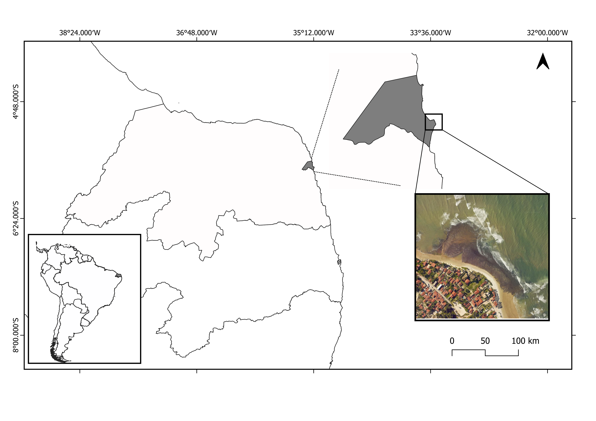

```{r setup, include=FALSE}
knitr::opts_chunk$set(echo = TRUE,
                      warning = FALSE,
                      message = FALSE)

```

**TITLE:** WHO PREYS ON CHITONS? CHITON PREDATORS AND A NEW CASE TO THE BRAZILIAN REEF OCTOPUS 

**AUTHORS AND AFFILIATIONS:** 

Guido G Grimaldi*
(Orchid: 0000-0002-6947-1957).
Postgraduate Program in Ecology at the Federal University of Santa Catarina, Florianopolis, Santa Catarina, Brazil, 88040-970.
guidogrimaldi@gmail.com.

Raiane dos Santos Guidi.
(Orchid: 0000-0002-4901-5022).
Laboratory of Sensory Ecology, Department of Physiology and Behavior, Federal University of Rio Grande do Norte, Natal, Rio Grande do Norte, Brazil, 59064-741. raianeguidi_13@hotmail.com.

Eduardo de Oliveira Bastos
(Orchid: 0000-0001-6710-7281).
Phycology Laboratory, Department of Botany, Biological Science Center, Federal University of Santa Catarina, Florianópolis, Santa Catarina, Brazil,  88040-535.
bastos_e@hotmail.com.

Paula Spotorno
(Orchid: 0000-0001-7771-3402).
Center for Computational Sciences, Federal University of Rio Grande, Rio Grande, Rio Grande do Sul, Brazil, 96203-900.
paula.spotorno@gmail.com.

Jaime A Jardim
(Orchid: 0000-0002-5511-7172).
Oceanographic Institute, Department of Biological Oceanography, University of São Paulo, São Paulo, Brazil, 05508-120.
jardim.jaime@gmail.com.

Tatiana Silva Leite
(Orchid: 000-0001-9117-9648).
Department of Ecology and Zoology, Biological Science Center, Federal University of Santa Catarina, Florianópolis, Santa Catarina, Brazil, 88040-970.
tati.polvo@gmail.com.

Daniel Marques Almeida Pessoa
(Orchid: 0000-0002-2516-6766)
Department Physiology and Animal Behavior, Federal University of Rio Grande do Norte, Natal, Rio Grande do Norte, Brazil, 59064-741.
daniel.pessoa@ufrn.br.

Paulo Antunes Horta
(Orchid: 0000-0001-7699-7589).
Department of Botany, Biological Science Center, Federal University of Santa Catarina, Florianópolis, Santa Catarina, Brazil, 88040-535
pauloantuneshorta@gmail.com.


***Corresponding author:** Guido Grimaldi (guidogrimaldi@gmail.com).

# **ABSTRACT**

Chitons are eight-shelled mollusks that has thrived in oceans worldwide for at least 540 million years, playing a crucial ecological role in regulating populations of algae and others communities. Despite this, chitons remain relatively unfamiliar to the general public, and even for the scientific community. Information about chiton ecology is scarce, specially about their inter-specific relationships, and even details about their predators are notably absent from major undergraduate invertebrate biology textbooks.

. In this study, we review the scientific literature to identify the main groups of animals that prey on chitons, specifying the predator species involved, the contexts of these predator-prey interactions, methods of observation, and the chiton species targeted. Additionally, we present a new field record of an interaction between a juvenile Brazilian reef octopus, Octopus insularis, and the endemic West Atlantic chiton Ischnoplax pectinata, a species with limited ecological data. Our survey identified fish, starfish, crabs, birds, octopuses, sea snails, polychaetes, and lobsters as the primary predators of chitons. Predation was predominantly observed in manipulative experiments or inferred through indirect methods, with only two studies documenting predation in natural habitats. In our field observations, a juvenile octopus preyed on an adult chiton hiding beneath a boulder. The chiton’s head plate was disarticulated and partially retained by the girdle, with no visible drill holes were observed on its shell. Chitons are notoriously difficult to prey upon due to their strong attachment to hard substrates, especially when disturbed. Predators can use different foraging and prey-handling strategies based on their own traits and the specific characteristic of their prey and habitat. Fish may peck or bite, birds deliver sharp jabs with their beaks, crabs use their claws to grip and crush, and sea snails drill hole into their prey’s shells. Octopuses combine tactics similar to those of crabs and snails. In this context, the Brazilian reef octopuses’ juveniles emerge as prominent predators in intertidal reefs in northeastern Brazil. Our field observation of an octopus preying on a chiton beneath boulders challenges the assumption that hiding under boulders provides a reliable protection from predators. Despite being preyed upon by a wide range of predators, chitons have thrived evolutionary. Understanding the interactions between cryptic species, like octopuses and chitons, is essential for understanding the structure, dynamics, and vulnerabilities of tropical reef ecosystems. This knowledge is important for guiding conservation and management efforts in boulder reef systems amid the challenges posed by climate change and biodiversity loss.

**KEYWORDS:** Borehole, Boulders, Cephalopoda, Drill hole, Intertidal reefs, Ischnoplax pectinata, Mollusca, Polyplacophora.

# BACKGROUND
Predation is considered a powerful evolutionary force that drives adaptive radiation, inducing genetic variation and promoting phenotypic diversity (Bond and Kamil 2002; Nosil and Crepi 2006; Tigreros et al. 2021). As an ecological mechanism, its effect is noticeable at different ecological scales, shaping prey distributions, habitat use, population dynamics, food webs, and ensuring the flow of energy through ecosystems (Guo et al. 2023; Johnson-Bice et al. 2023; Carroll et al. 2024; Orrick et al. 2024). Being preyed upon may be the most tearing fate an individual can face in its lifetime. Avoiding predation is therefore critical to individual's fitness (Palmer and Packer 2021). Evolution offers remarkable examples of how natural selection has shaped strategies for organisms to prevent predator detection or defend themselves after being detected (Ruxton et al. 2018). The former associate phenotypical variations, such as color patterns, transparency, and morphological outgrowths, with behavioral changes that help organisms avoid detection or be misidentified as an inedible object like sticks, leaves, seaweed, or bird-droppings (Arias et al. 2019; Cuthill 2019; Stevens and Ruxton 2019). Additionally, the latter make organisms unprofitable for predators, such as developing spines, stingers, toxins, or even warning signals (Ruxton et al. 2018). In this way, the presence of predators in a given community can force prey to make behavioral choices between vital activities, such as feeding, and avoiding contact with predators by reducing activity or seeking refuge (Chauhan et al. 2024; Liao et al. 2024).

Chitons, or polyplacophorans, are eight-shell plate-bearing mollusks that are strongly associated with hard marine substrates (Eernisse 2007). As a lineage, polyplacophorans have survived major climate changes and transformation of Earth’s surface throughout its history (Wanninger and Wollesen, 2019). Their articulating shell-armature are similar to ancestral chitons species from the early Cambrian (ca. 540 Mya) and has been well-conserved in the living chitons lineages from the early Carboniferous ca. 340 mya (Sigwart 2009; Parkhaev 2017). Chitons occupy a diverse array of environments, including rocky shores, coral reefs, sandstone reefs, boulder fields, pebbles, rhodolith beds, and seagrass meadows, as well as unconventional deep habitats such sunken woods, whale bones, and hydrothermal vents (Kangas and Shepherd 1984; Schwabe and Sellanes 2004; Konar et al. 2006; Saito et al. 2008; Barros et al. 2013; Reyes-Gómez et al. 2017; Sigwart 2017; Barboza 2019). They use an iron-mineralized radula to scrape food from the substrate, often ingesting various organisms or even sediment particles in the process (Fulton 1975; Joester and Brooker 2016). As a result, many intertidal chitons capable of digesting both animal and plant matter are considered browsing omnivorous (Latyshev 2004; Sigwart and Schwabe 2017). Ecologically, chitons can regulate algae growth through grazing, while also exerting an unintentional “bulldozing-effect” on larvae and post-metamorphic invertebrate stages, influencing heterogeneity and community composition (Aguilera and Navarrete 2007, 2012; Aguilera et al. 2015; Liversage and Kotta 2019).

Details on chiton predators are not included in major undergraduate textbooks on invertebrate biology (Brusca et al. 2023). This information is scattered throughout scientific literature of various fields, including zoology, ecology, and animal behavior, and may even be unknown to chiton researchers who are confined to literature of their specific group. Most studies focus on the diets of other animals, where chitons are merely one of the food items found in the species’ stomach/gut contents (Irons et al. 1986; Petracci et al. 2004). Additionally, chitons are often overlooked by the untrained eye and are deemed ‘rare’ by conventional marine ecology methods. This probably is because chitons are typically negatively photosensitive, hiding in crevices, holes, depressions, or under rocks during daylight low tides – the period when the most marine ecology studies are conducted (Miller & Ambrose, 2000; Vermeiren & Seaves, 2014; Montes et al. 2021). On intertidal boulder reefs, they are often seen crawling and feeding on the side surfaces of boulders during nighttime low tides (Jörger et al. 2008; Liversage & Benkendorff, 2017), though their activity patterns seem to vary by species and habitat type (Demopulos, 1975; Kangas & Shepherd, 1984; Cretchley et al. 1997). Chitons’ activity patterns are influenced by a variety of tidal and non-tidal rhythms, such as tidal regimes, the light-dark daily cycle, season, and climate (Glynn 1970; Ng and Williams 2006; Yoshioka and Fujitani 2006). These patterns seem to be related to protecting them from direct solar radiation, and preventing high temperature and desiccation (Shick 2007). Ecologically, it is assumed that the chitons’ permanence under boulders during daylight provides not only physiological benefits to fitness but also protection from potential visual guided predators (Schmitt 1982; Rodrigues and Absalão 2005).

Octopuses are a prominent shallow-water predator adapted for foraging and feeding in complex marine habitat such as boulder reefs (Mather 2021). They use multiple sensory information to perceive their surroundings and navigate within their environment, including vision, mechanoreception, and chemical sensing (Buresch et al. 2022). Octopus predation is probably a major cause of mortality for many benthic marine species, especially for crabs, bivalves, and gastropods (Anderson et al. 2008). Chitons can also be included in octopus's diet, although they seem to be a less preferred prey (Mather 1991). The Brazilian reef octopus, Octopus insularis (Leite et al. 2008), is a diurnal species (O’Brien et al. 2023) with juveniles commonly found in intertidal reefs in northeastern Brazil (Batista and Leite 2016). Their diet consists of small crustaceans, bivalves, and gastropods, with occasional consumption of large preys (Dantas et al. 2022). Chitons may also be a frequent part of their diet (Dantas et al. 2020), but details about which chiton species are targeted, conditions and habitat where this interaction occur, and life stages involved remain unknown.

Here, we present a mini-review of the species and animal groups that prey on chitons, based on a literature survey of studies documenting chiton predator-prey relationships. We describe the species that prey on chitons, the conditions under which observations were made, and the chiton species targeted. Additionally, we also documented a direct field observation of the interaction between the Brazilian reef octopus (O. insularis) and an endemic West Atlantic chiton species, Ischnoplax pectinata (G.B.Sowerby II, 1840), with scarce ecological data.

# MATERIALS AND METHODS
## Study site
Observation occurred along an intertidal reef in Santa Rita beach (05°41′S, 35°11′W), Rio Grande do Norte, Brazil (Figure 1). The region presents a tropical humid climate, with rainfall occurring during the austral spring (Vital et al. 2016). Winds come predominantly from the southeast (Silva et al. 2002). Tides are semidiurnal with meso-tidal regime (Vital et al., 2016). Siliciclastic sands predominantly dominate the beaches (Vital 2009). The Santa Rita reef is a linear formation along the coast of limited height (no more than 1m). It is characterized by rocky outcrops and irregular boulders, red or black iron-colored, which can either be loosely distributed on the sediment or other rocks (Barboza 2019).



## Field Procedures
As part of the field study on the chiton species *I. pectinata* (in preparation), measurements of water temperature and tide level relative to the base of the boulder were taken before handling the boulder, while weight was measured as the final step after handling. Water temperature was recorded with a thermometer over five minutes, and tide level was measured using a measuring tape. The boulder’s weight was determined by placing it inside a cloth bag and weighing it with a handheld scale. Visual field identification used to determine the octopus’s species (*O. insularis*) was based on distinct red/white body patterns and habitat (O’brien et al. 2021). The chiton was identified as *I. pectinata*, based on their convex valves sculptured by radial ribs (Gomes 2015).

## Bibliographic survey

A bibliographic survey was conducted in the Scopus database in May 2025, with the objective of identifying the animal groups that prey on chitons. The search employed the terms “chiton” OR “polyplacophora” AND “prey” OR "predator*", applied to the article title, abstract, and keyword sections. The search was limited to articles, reviews, and notes, with no restrictions on subject area, but restricted to publications in English and Spanish. The survey covered literature published between 1959 and 2024. The results of the primary search were filtered by examining the titles, abstracts, and keywords to assess their relevance to the objectives of the literature review. Studies deemed potentially relevant were then subjected to full-text evaluation. In addition, a secondary search was conducted by examining the reference sections of the selected articles. Further relevant sources were identified through suggestions from the authors and direct communication with researchers in the field (Supplementary material 1).

# RESULTS
## Field Observation
On April 13, 2021 (10:50 am), during our ecological fieldwork with I. pectinata at Santa Rita Reef (Figure 2A), we encountered a juvenile O. insularis (~2 cm eye distance) feeding on a chiton beneath a boulder we overturned (Figure 2B). Due to the disturbance, the octopus quickly fled, leaving behind fresh chiton remains (Figure 2C). T). The boulder (3kg) was situated in the lower mesolittoral zone, resting on a bed of sand and silt. It was exposed during low tide (0.3), but a shallow layer (0.9 cm) of warmer water (30°C) covered its lower portion. The chiton remains (length: 3cm, Figure 2C), identified as I. pectinata, exhibited freshness, including foot tissue, gills, and mantles with the head plate (Plate I) disarticulated and partially held by the girdle (Figure 2D). We did not observe any apparent drill holes.

Figure 2: A. Santa Rita reef during low tide, Rio Grande do Norte, Brazil. B. The Brazilian reef octopus (Octopus insularis). C. The remains of the chiton (Ischnoplax pectinata) in ventral view, with traces of gills, foot tissue, and mantles. Dorsal view, showing the disarticulated cephalic valve is discarded the held together by the girdle. Image: R. Guidi.

# Chiton Predators
Chitons can be preyed upon by several animals from different taxa, including other members of the phylum Mollusca (Table 1). There are sixty-four recorded species that prey on chitons, although some records do not specify the exact chiton species consumed. The main groups of predators are fishes (30 spp.), starfishes (9 spp.), crabs (8 spp.), birds (6 spp.), octopuses (5 spp.), sea snails (4 spp.), polychaetes (1 sp.), and lobsters (1 sp.). Fish are the most diverse predators of chitons, with species including grunts, wrasses, porgies, blennies, puffers, groupers, boxfish, damselfish, triggerfish, tilefish, squirrelfish, and goatfish. Starfish are also an important predatory group of chitons, although their diversity of predator’s species is predominantly concentrated in the Asteridae family. Among crabs, the richness of species reflected greater family diversity. For birds, the primary predators are gulls, black oystercatchers, harlequin ducks, and common eiders. Among mollusks, all sea snail species, except L. dirum, are muridic gastropods, while all octopuses belong to the genus Octopus. Only one species of polychaetes, the bearded fireworm, was recorded as preying on chitons and only the Caribbean spine lobster was recorded with chitons in its gut content.

Forty-seven species of chitons were either consumed directly or found in the stomach/gut contents of predators. For most predators, only species-specific relationships with chitons have been documented. However, the fish species Notolabrus tetricus and Diplodus vulgaris notably prey on a wide variety of chiton species, with the former potentially being a key predator of chitons in boulder field habitats. In these habitats, only octopuses, crabs, and fish have been identified as predator of boulder-dwelling chitons species.

**Table 1**: Studies reporting chiton predators. The scientific names were used according to the currently accepted nomenclature in WoRMS. In table footnote, boulder chitons and their respective studies.

Most studies rely on indirect methods such as analyzing stomach or gut content, regurgitation pellets, fecal samples, drill holes (boreholes), or prey remain. Studies reporting direct interactions typically occur under limited or artificial condition, such as prey choice experiments in laboratory or natural settings. Only two studies report in situ observations which starfish directly feeding on chitons.

# DISCUSSION
Chitons are fascinating mollusks found in oceans worldwide, closely associated with hard marine substrates. They play a crucial ecological role in regulating populations of algae and other benthic organisms. Despite of their importance, chitons are relatively unknow to the general public and often overlooked even by biologists. Much of the knowledge about their biology, ecology, and behavior remains scattered across the scientific literature and has not been systematized in major invertebrate biology textbooks, this including details about their predators. In this study, we compile information on species and animal groups that prey on chitons, the contexts of these predator-prey interactions, methods of observation, and the chiton species targeted. The primary predators identified include fish, starfish, crabs, birds, octopuses, sea snails, polychaetes, and lobsters. Additionally, we present a new field record of an interaction between a juvenile Brazilian reef octopus, Octopus insularis, and the endemic West Atlantic chiton Ischnoplax pectinata, a species with limited ecological data. This observation is the first documented interspecific relationship between O. insularis and I. pectinata, highlighting the role of juvenile Brazilian reef octopuses as prominent predators in intertidal boulder field habitat in northeastern Brazil. Although the Brazilian reef octopus are indirectly known to consume chitons (Dantas et al. 2020), the latter are likely less preferred or opportunistically preyed upon, as the octopuses’ diet mainly consists of small crustaceans, bivalves, and gastropods (Batista and Leite 2016; Leite et al. 2016).

In our survey, we found only two studies reporting predation on chitons in their natural habitats. These studies focused on sea star species, which typically feed by spreading their stomachs over their prey, secreting digestive enzymes, and ingesting the partially digested mixture (Brusca et al. 2022). For the remaining studies, predation on chitons was only observed in manipulative experiments or through indirect methods, such as analyzing stomach/gut contents, regurgitation pellets, drill holes, stable isotopes, and prey remains. This highlights the challenge of directly observing predation and prey selection in nature (Smith and Ruxton 2020). This is especially evident with invertebrates, where visually cryptic species further complicate field studies, necessitating significant effort and financial resources (Sunderland 1988; Birkhofer et al. 2017). Predation events under natural conditions are seldom observed, even in octopuses’ studies where visual search methods and in situ dives are heavily employed (Leite et al. 2009a, 2016). In such cases, opportunistic recording can be a valuable tool for gaining insight into the true nature of predator-prey interactions.

Chitons are notoriously difficult to prey upon due to their resistance to removal from hard substrates, especially when disturbed (Linsenmeyer 1975; Brusca et al. 2022). The shear force required to dislodge a 5 cm long chiton is five times greater than that required to dislodge a sea urchin of approximately the same diameter (Irons et al. 1986). Predators can use different foraging and prey-handling strategies based on their own traits and the specific characteristic of their prey and habitat (Grisley et al. 1999; Buresch et al. 2022). It is likely that birds feeding on mollusks with habits similar to chitons, such limpets, use comparable foraging strategies. For example, oystercatchers deliver sharp jabs with their beaks to the edges of limpet shells to crack them, making it easier to dislodge the animal from the rock surface (Hartwick, 1973). Likewise, gulls have been observed prying chitons off rocks with their beaks, either swallowing them whole or removing the soft tissue from their feet and gills (Burnaford 2004, personal observation). In many reef fish, morphological adaptations of teeth are closely linked to their feeding habits (Santic et al. 2007). Fish primarily capture prey through pecking or biting (Corn et al. 2022). Their robust molar teeth are specifically adapted for crushing the hard exoskeletons and hard shell of decapods and mollusks (Deng et al. 2022). It is possible that the chiton-rich diet of N. tetricus and D. vulgaris is a specialization associated with the large number of molars in their jaws (Pallaoro 2006). However, the diversity of chiton species in diet of the Blue-throated wrasse, N. tetricus, may also be related to a methodological bias, as the researchers turned over the boulders, thereby exposing the cryptic species to predation (Shepherd and Clackson, 2001). Crabs likely use strategies similar to those employed with limpets to handle chitons, using their claws to grasp, crush, leverage, and pull their prey (Silva et al. 2008). Non-chelate crustaceans like spiny lobsters probably uses its mandibles in the place of a claw to crash chitons shell (Randall, 1964; Lau, 1987). This probably occurs at the late juvenile-adult stage of lobsters, when they have a carapace length of between 45–80 mm. At this stage, the jaws are more calcified, with more defined molar and incisor processes, being able to easily crush the resistant chitinous exoskeletons of large mollusks (Cox et al. 2008).

Among mollusks, many predatory snails use their radula to rasp and drill holes through the shells of their prey, effectively killing them (Mondal et al. 2021). The most notable drilling gastropod belong to the families Naticidae, Muricidae, Thaididae, and Nassariidae (Reyment, 1967). Variations in the shape of the hole allow the identification of the predator at the family level (Carriker and Yochelson 1968). For example, naticid snails drill distinctively tapered-parabolic hole, whereas muricid snails produce holes with nearly straight sides; Carriker 1981). Notably, chitons plates with boreholes have been documented in the Late Pleistocene fossil record (Rojas et al., 2014). Octopuses can also drill the shells of their preys. As an muscular long-armed mollusks, they can employ several foraging strategies and multimodal sensing techniques adapted to different natural prey context, combining tactics similar to those used by both crabs and snails (Mather 1991; Leite et al. 2009a; Buresch et al. 2022). These abilities make them a truly remarkable predator. For example, they may initially try to forcibly detach the chiton from the substrate by pulling it, like crabs do. If this method fails, they may drill a hole in the shell and inject a secretory substance to make the chiton release its hold on the substrate, similar to how snails do (Nixon et al. 1980; Mondal et al. 2021). However, chitons do not necessarily need to be drilled to be ingested (Cortez et al. 1998). According to Mather and Nixon (1990), when referring to juvenile O. insularis (identified as O. vulgaris) from Bermuda´s shallow waters, “sometimes the octopus consumed the internal organs of the chiton and discarded the valves held together by the girdle”, which is similar to our findings with juvenile O. insularis. 

Many marine intertidal organisms, such as chitons, brittle stars, and worms, are habitat specialist species that exhibit phototropic cryptic behavior (Sumner-Rooney et al. 2021). They hide under boulders and within crevices during the daytime to avoid solar radiation, high temperatures, and desiccation (Denny, 2007). This strategy of seeking refuge beneath boulder is considered particularly effective against visually guided predators (Grayson and Chapman 2004). However, intertidal boulders are often naturally overturned by waves, storms, and hurricanes (McGuinness 1987b; Etienne et al. 2011; Li et al. 2023), or even by animals (Randall 1967; Webb and Whiting 2006; Liversage and Benkendorff 2017). Consequently, the risk of predation likely exerts strong selection pressure on chitons to avoid smaller boulders that are more easily overturned (Schmitt, 1982). Our field observation of octopus predation on a chiton during low tide challenges the assumption that hiding beneath boulders offers reliable protection from visual predators. In this instance, the octopus preyed on the chiton without the need to overturn the boulder. Although shallow-water octopuses possess an excellent visual system, they are also highly adapted to hunting cryptic prey (Buresch et al., 2024). When visual cues are unavailable, octopuses utilize chemo- and mechanoreceptors in their arms to "blindly" search for prey hidden in rock holes, crevices, or beneath boulders, bypassing the need to turn them over (Buresch et al., 2024). This behavior is particularly evident in Octopus insularis, a species that hunts during narrow daylight windows (O’Brien et al., 2023). It prioritizes fast, easily captured small prey over larger, more challenging prey (Leite et al., 2009b, 2016). Our observation suggests that boulder-dwelling chitons are vulnerable to predation not only at night, when they are apparently active on the lateral side of boulders (Liversage and Benkendorff, 2017), but also during the day. This could help refine estimates of octopus predation rates on chitons in intertidal boulder fields (Sunderland, 1988).

# CONCLUSION
The West Atlantic chiton I. pectinata is a cryptic species with limited ecological information. Understanding its ecological relationships is crucial for assessing its impact on individual growth, survival, and reproduction. Additionally, it allows us to recognize their role in structuring communities and ecosystem functions. 

Despite their ecological significance, little is known about the natural interactions between chitons and their predators. Most studies exploring these relationships have been conducted in controlled laboratory or experimental conditions, often requiring the manipulation of species and scenarios to facilitate encounters. Much of the current knowledge is derived from indirect methods, such as dietary analyses of predators where chitons were not the primary focus. Consequently, field observations under natural conditions remain invaluable for uncovering the true nature of these predator-prey interactions.
The fact that chitons are preyed upon by a wide range of predators has not hindered their evolutionary success. This ancient group has thrived in seas worldwide for at least 540 million years (Wanninger and Wollesen, 2019). Understanding these interactions with cryptic species is essential for piecing together the larger ecological puzzle (Scheibling et al., 2009). It provides critical insights into the structure, dynamics, and vulnerabilities of tropical ecosystems, guiding conservation and management efforts amid the challenges of climate change and biodiversity loss (Gross, 2023).

Acknowledgements: We would like to thank Professor Jennifer Mather.

Authors’ contributions: Conceptualization: GG. Field procedures and record: GG RSG. Image and visualization: GG, RSG, EB. Bibliographic survey: GG. Supervision: DMAP PAH. Writing, original draft: GG RSG TSL DMAP PAH. Writing, review & editing: GG RSG EB PS JAJ TSL DMAP PAH. All authors approved the final manuscript and consent to publication.

Competing interests: Not applicable.

Availability of data and materials: Not applicable.

Consent for publication: Not applicable.

Ethics approval consent to participate: Not applicable.

# REFERENCES
Aguilera MA, Navarrete SA (2007) Effects of Chiton granosus (Frembly, 1827) and other molluscan grazers on algal succession in wave exposed mid-intertidal rocky shores of central Chile. Journal of Experimental Marine Biology and Ecology 349:84–98. https://doi.org/10.1016/j.jembe.2007.05.002
Aguilera MA, Navarrete SA (2012) Functional identity and functional structure change through succession in a rocky intertidal marine herbivore assemblage. Ecology 93:75–89. https://doi.org/10.1890/11-0434.1
Aguilera MA, Valdivia N, Broitman BR (2015) Herbivore-Alga Interaction Strength Influences Spatial Heterogeneity in a Kelp-Dominated Intertidal Community. PLOS ONE 10:e0137287. https://doi.org/10.1371/journal.pone.0137287
Ambrose RF (1984) Food preferences, prey availability, and the diet of Octopus bimaculatus Verrill. Journal of Experimental Marine Biology and Ecology 77:29–44. https://doi.org/10.1016/0022-0981(84)90049-2
Anderson R, Wood J, Mather J (2008) Octopus vulgaris in the Caribbean is a specializing generalist. Mar Ecol Prog Ser 371:199–202. https://doi.org/10.3354/meps07649
Arias M, Mappes J, Desbois C, et al (2019) Transparency reduces predator detection in mimetic clearwing butterflies. Functional Ecology 33:1110–1119. https://doi.org/10.1111/1365-2435.13315
Barboza ARP (2019) Invertebrados bentônicos de recifes areníticos tropicais: avaliação de métodos e estruturação da comunidade intertidal. doctoralThesis, Federal University of Rio Grande do Norte
Barros K, Jardim J, Rocha-Barreira C (2013) Ecological observations on polyplacophora in a Halodule wrightii Ascherson meadow and new records for Northeast and Brazilian Cost. Revista Nordestina de Zoologia 7:27–40
Batista AT, Leite TS (2016) Octopus insularis (Cephalopoda: Octopodidae) on the tropical coast of Brazil: where it lives and what it eats. Braz j oceanogr 64:353–364. https://doi.org/10.1590/S1679-87592016123406404
Bergman CM, Pattison J, Price E (2013) The Black Oystercatcher as a Sentinel Species in the Recovery of the Northern Abalone: Contemporary Diet of Black Oystercatchers on Haida Gwaii Includes an Endangered Prey Species. The Condor 115:800–807. https://doi.org/10.1525/cond.2013.120182
Bernárdez C, Freire J, González-Gurriarán E (2000) Feeding of the spider crab Maja squinado in rocky subtidal areas of the Ría de Arousa (north-west Spain). Journal of the Marine Biological Association of the United Kingdom 80:95–102. https://doi.org/10.1017/S0025315499001605
Birkhofer K, Bylund H, Dalin P, et al (2017) Methods to identify the prey of invertebrate predators in terrestrial field studies. Ecol Evol 7:1942–1953. https://doi.org/10.1002/ece3.2791
Bond AB, Kamil AC (2002) Visual predators select for crypticity and polymorphism in virtual prey. Nature 415:609–613. https://doi.org/10.1038/415609a
Brusca RC, Giribet G, Moore  and W (2022) Invertebrates, Fourth Edition. Oxford University Press, New York, USA
Buresch KC, Sklar K, Chen JY, et al (2022) Contact chemoreception in multi-modal sensing of prey by Octopus. J Comp Physiol A Neuroethol Sens Neural Behav Physiol 208:435–442. https://doi.org/10.1007/s00359-022-01549-y
Burnaford JL (2004) Habitat Modification and Refuge from Sublethal Stress Drive a Marine Plant–Herbivore Association. Ecology 85:2837–2849. https://doi.org/10.1890/03-0113
Carriker MR (1981) Shell penetration and feeding by naticacean and muricacean predatory gastropods: a synthesis. Malacologia 20:403–422
Carriker MR, Yochelson EL (1968) Recent gastropod boreholes and Ordovician cylindrical borings. Professional Paper. https://doi.org/10.3133/pp593B
Carroll G, Abrahms B, Brodie S, Cimino MA (2024) Spatial match–mismatch between predators and prey under climate change. Nat Ecol Evol 1–9. https://doi.org/10.1038/s41559-024-02454-0
Chapman MG (2002) Patterns of spatial and temporal variation of macrofauna under boulders in a sheltered boulder field. Austral Ecol 27:211–228. https://doi.org/10.1046/j.1442-9993.2002.01172.x
Chapman MG (2005) Molluscs and echinoderms under boulders: Tests of generality of patterns of occurrence. J Exp Mar Biol Ecol 325:65–83. https://doi.org/10.1016/j.jembe.2005.04.016
Corn KA, Friedman ST, Burress ED, et al (2022) The rise of biting during the Cenozoic fueled reef fish body shape diversification. Proceedings of the National Academy of Sciences 119:e2119828119. https://doi.org/10.1073/pnas.2119828119
Cortez T, Castro BG, Guerra A (1998) Drilling behaviour of Octopus mimus Gould. J Exp Mar Biol Ecol 224:193–203. https://doi.org/10.1016/S0022-0981(97)00198-6
Cox C, Hunt JH, Lyons WG, Davis GE (1997) Nocturnal foraging of the Caribbean spiny lobster (Panulirus argus) on offshore reefs of Florida, USA. Mar Freshwater Res 48:671–680. https://doi.org/10.1071/mf97198
Cox SL, Jeffs AG, Davis M (2008) Developmental changes in the mouthparts of juvenile Caribbean spiny lobster, Panulirus argus: Implications for aquaculture. Aquaculture 283:168–174. https://doi.org/10.1016/j.aquaculture.2008.07.019
Cretchley R, Hodgson AN, Gray DR, Reddy K (1997) Variation in foraging activity of Acanthochitona garnoti (Mollusca: Polyplacophora) from different habitats. South African Journal of Zoology 32:59–63. https://doi.org/10.1080/02541858.1997.11448431
Cuthill IC (2019) Camouflage. Journal of Zoology 308:75–92. https://doi.org/10.1111/jzo.12682
Dantas RJ de S, Leite TS, de Albuquerque CQ (2022) The trophic interactions of Octopus insularis in the food web of a pristine tropical atoll: a baseline for management and monitoring under environmental changes. Aquat Ecol 56:269–284. https://doi.org/10.1007/s10452-021-09917-7
Dantas RJS, Leite TS, Albuquerque CQ (2020) Assessing the diet of octopuses: traditional techniques and the stable isotopes approach. J Molluscan Stud 86:210–218. https://doi.org/10.1093/mollus/eyaa003
DeBevoise A (1975) Predation on the chiton Cyanoplax hartwegii (Mollusca: Polyplacophora). Veliger 18:47–50
Demopulos PA (1975) Diet, Activity and Feeding in Tonicella lineata (Wood,1815). The Veliger 18:42–46
Deng Z, Loh H-C, Jia Z, et al (2022) Black Drum Fish Teeth: Built for Crushing Mollusk Shells. Acta Biomaterialia 137:147–161. https://doi.org/10.1016/j.actbio.2021.10.023
Denny MW, Gaines SD (2007) Brittle Stars. In: Encyclopedia of Tidepools and Rocky shores. University of California Press, California, pp 113–114
Eernisse D (2007) Chitons. In: Encyclopedia of Tidepools and Rocky shores, 1st edn. University of California Press, Berkeley, pp 127–133
Etienne S, Buckley M, Paris R, et al (2011) The use of boulders for characterising past tsunamis: Lessons from the 2004 Indian Ocean and 2009 South Pacific tsunamis. Earth-Sci Rev 107:76–90. https://doi.org/10.1016/j.earscirev.2010.12.006
Evans FGC (1951) An Analysis of the Behaviour of Lepidochitona cinereus in Response to Certain Physical Features of the Environment. The Journal of Animal Ecology 20:1. https://doi.org/10.2307/1640
Fulton FT (1975) The Diet of the chiton Mapolia lignosa (Gould, 1846) (Mollusca: Polyplacophora). Veliger 18:38–41
Gaines W, Fitzner R (1987) Winter diet of the harlequin duck at Sequim Bay, Puget Sound, Washington. Northwest Science 61:213–215
Glynn PW (1970) On the ecology of the Caribbean chitons Acanthopleura granulata Gmelin and Chiton tuberculatus Linné: density, mortality, feeding, reproduction, and growth. Smithson Contrib Zool 66:1–21. https://doi.org/10.5479/si.00810282.66.
Gomes JAJ (2015) Revisão taxonômica do gênero Ischnoplax (Chitonoidea; Callistoplacidae) do Atlântico Oeste. Text, Universidade de São Paulo
Grayson JE, Chapman MG (2004) Patterns of distribution and abundance of chitons of the genus Ischnochiton in intertidal boulder fields. Austral Ecol 29:363–373. https://doi.org/10.1111/j.1442-9993.2004.01375.x
Grisley MS, Boyle PR, Pierce GJ, Key LN (1999) Factors affecting prey handling in lesser octopus (Eledone cirrhosa) feeding on crabs (Carcinus maenas). Journal of the Marine Biological Association of the United Kingdom 79:1085–1090. https://doi.org/10.1017/S0025315499001332
Guo P, Li C, Liu J, Chai B (2023) Predation has a significant impact on the complexity and stability of microbial food webs in subalpine lakes. Microbiology Spectrum 11:e02411-23. https://doi.org/10.1128/spectrum.02411-23
Gushima K, Hazumi Y, Kakuta S (1991) Growth-Related Changes in Diet and Foraging Behavior of the Yellow Wrasse Thalassoma lutescens at Kuchierabu Island. Japanese Journal of Ichthyology 38:307–313. https://doi.org/10.11369/jji1950.38.307
Hartwick EB (1973) Foraging strategy of the black oystercatcher. University of British Columbia
Irons DB, Anthony RG, Estes JA (1986) Foraging Strategies of Glaucous-Winged Gulls in a Rocky Intertidal Community. Ecology 67:1460–1474. https://doi.org/10.2307/1939077
Joester D, Brooker LR (2016) The Chiton Radula: A Model System for Versatile Use of Iron Oxides*. In: Faivre D (ed) Iron Oxides: From Nature to Applications, 1st edn. Wiley, pp 177–206
Johnson-Bice SM, Gable TD, Roth JD, Bump JK (2023) Patchy indirect effects of predation: predators contribute to landscape heterogeneity and ecosystem function via localized pathways. Oikos 2023:e10065. https://doi.org/10.1111/oik.10065
Kangas M, Shepherd SA (1984) Distribution and feeding of chitons in a boulder habitat at West Island, South Australia. J Malacol Soc Aust 6:101–111. https://doi.org/10.1080/00852988.1984.10673963
Konar B, Riosmena-Rodriguez R, Iken K (2006) Rhodolith bed: a newly discovered habitat in the North Pacific Ocean. Bot Mar 49:355–359. https://doi.org/10.1515/BOT.2006.044
Kristjánsson TÖ, Jónsson JE, Svavarsson J (2013) Spring diet of common eiders (Somateria mollissima) in Breiðafjörður, West Iceland, indicates non-bivalve preferences. Polar Biol 36:51–59. https://doi.org/10.1007/s00300-012-1238-8
Laptikhovsky V, Brickle P, Söffker M, et al (2015) Life history and population characteristics of the Antarctic starfish, Anasterias antarctica Lütken, 1856 (Asteroidea: Forcipulatida: Asteriidae) around the Falkland Islands. Polar Biol 38:463–474. https://doi.org/10.1007/s00300-014-1608-5
Lau CJ (1987) Feeding Behavior of the Hawaiian Slipper Lobster, Scyllarides Squammosus, with a Review of Decapod Crustacean Feeding Tactics on Molluscan Prey. Bulletin of Marine Science 41:378–391
Leite TS, Batista AT, Lima FD, et al (2016) Geographic variability of Octopus insularis diet: from oceanic island to continental populations. Aquat Biol 25:17–27. https://doi.org/10.3354/ab00655
Leite TS, Haimovici M, Mather J (2009a) Octopus insularis (Octopodidae), evidences of a specialized predator and a time-minimizing hunter. Mar Biol 156:2355–2367. https://doi.org/10.1007/s00227-009-1264-4
Leite TS, Haimovici M, Mather J, Oliveira JEL (2009b) Habitat, distribution, and abundance of the commercial octopus (Octopus insularis) in a tropical oceanic island, Brazil: Information for management of an artisanal fishery inside a marine protected area. Fish Res 98:85–91. https://doi.org/10.1016/j.fishres.2009.04.001
Li L, Cai F, Qi H, et al (2023) Typhoon vs. cold wave: a comparative assessment of geomorphic response and boulder displacement using RFID technology. Acta Oceanol Sin 42:25–40. https://doi.org/10.1007/s13131-022-2083-4
Liao W, Zanca T, Niemelä J (2024) Predation risk modifies habitat use and habitat selection of diving beetles (Coleoptera: Dytiscidae) in an Urban Pondscape. Global Ecology and Conservation 49:e02801. https://doi.org/10.1016/j.gecco.2024.e02801
Linsenmeyer TA (1975) The Resistance of five species of Polyplacophorans to removal from Natural and Artificial Surfaces. Veliger 18:83–86
Liversage K, Benkendorff K (2017) The first observations of Ischnochiton (Mollusca, Polyplacophora) movement behaviour, with comparison between habitats differing in complexity. PeerJ 5:e4180. https://doi.org/10.7717/peerj.4180
Liversage K, Benkendorff K (2013) A preliminary investigation of diversity, abundance, and distributional patterns of chitons in intertidal boulder fields of differing rock type in South Australia. Molluscan Research 33:24–33. https://doi.org/10.1080/13235818.2012.754145
Liversage K, Cole VJ, McQuaid CD, Coleman RA (2012) Intercontinental tests of the effects of habitat patch type on the distribution of chitons within and among patches in intertidal boulder field landscapes. Mar Biol. https://doi.org/10.1007/s00227-012-2038-y
Louda SM (1979) Distribution, movement and diet of the snail Searlesia dira in the intertidal community of San Juan Island, Puget Sound, Washington. Marine Biology 51:119–131. https://doi.org/10.1007/BF00555191
Mather J (1991) Foraging, feeding and prey remains in middens of juvenile Octopus vulgaris (Mollusca: Cephalopoda). J Zool 224:27–39. https://doi.org/10.1111/j.1469-7998.1991.tb04786.x
Mather J (2021) Octopus Consciousness: The Role of Perceptual Richness. NeuroSci 2:276–290. https://doi.org/10.3390/neurosci2030020
Mather J, Nixon M (1990) Octopus vulgaris drills Chiton. J Cephalopod Biol 1:113–116
Mauzey KP (1966) Feeding Behavior and Reproductive Cycles in Pisaster ochraceus. The Biological bulletin 131:127–144. https://doi.org/10.2307/1539653
Mauzey KP, Birkeland C, Dayton PK (1968) Feeding Behavior of Asteroids and Escape Responses of their Prey in the Puget Sound Region. Ecology 49:603–619. https://doi.org/10.2307/1935526
Mazé RA, Domínguez J, Pérez-Cardenal D (1999) Diet of Lipophrys pholis (L.) (Teleostei, Blenniidae) in Cantabrian coastal waters (Spain). Acta Oecologica 20:435–448. https://doi.org/10.1016/S1146-609X(99)00124-1
McGuinness KA (1987) Disturbance and Organisms on Boulders. II. Causes of Patterns in Diversity and Abundance. Oecologia 71:420–430. https://doi.org/10.1007/BF00378716
Mendonça V, Vinagre C, Boaventura D, et al (2016) Chitons’ apparent camouflage does not reduce predation by green crabs Carcinus maenas. Marine Biology Research 12:125–132. https://doi.org/10.1080/17451000.2015.1088951
Mondal S, Maitra A, Bose K, et al (2021) Substrate-controlled naticid gastropod drilling predation on recent barnacles from Chandipur, India and its Palaeontological implications. Historical Biology 33:1029–1042. https://doi.org/10.1080/08912963.2019.1677639
Moore MM (1975) Foraging of the western gull, Larus occidentalis and its impact on the chiton Nuttalina californica. Veliger 18:51–53
Ng J, Williams G (2006) Intraspecific variation in foraging behaviour: influence of shore height on temporal organization of activity in the chiton Acanthopleura japonica. Mar Ecol Prog Ser 321:183–192. https://doi.org/10.3354/meps321183
Nixon M, Maconnachie E, Howell PGT (1980) The effects on shells of drilling by Octopus. J Zool 191:75–88. https://doi.org/10.1111/j.1469-7998.1980.tb01450.x
Nosil P, Crespi BJ (2006) Experimental evidence that predation promotes divergence in adaptive radiation. Proceedings of the National Academy of Sciences 103:9090–9095. https://doi.org/10.1073/pnas.0601575103
O’Brien CE, Bennice CO, Leite TS (2021) A field guide to distinguishing Octopus insularis and Octopus americanus (Octopoda: Octopodidae). Zootaxa 5060:589–594. https://doi.org/10.11646/zootaxa.5060.4.8
O’Brien CE, Medeiros SL de S, Leite T (2023) Octospy: What Octopus insularis do in their dens. Marine Ecology 44:e12763. https://doi.org/10.1111/maec.12763
Orrick K, Sommer N, Rowland F, Ferraro K (2024) Predator–prey interactions across hunting mode, spatial domain size, and habitat complexities. Ecology 105:e4316. https://doi.org/10.1002/ecy.4316
Ortiz M, Jesse S, Stotz W, Wolff M (2003) Feeding behaviour of the asteroid Meyenaster gelatinosus in response to changes in abundance of the scallop Argopecten purpuratus in northern Chile. Archiv für Hydrobiologie 213–225. https://doi.org/10.1127/0003-9136/2003/0157-0213
Pallaoro A, Šantić M, Jardas I (2006) Feeding habits of the common two-banded sea bream, Diplodus vulgaris (Sparidae), in the eastern Adriatic Sea. Cybium 30:19–25.
Palmer ANS (2012) Spatial and genetic investigation of aggregation in Ischnochiton (Polyplacophora; Neoloricata; Ischnochitonina; Ischnochitonidae; Ischnochitoninae) species with different larval development. Austral Ecology 37:110–124. https://doi.org/10.1111/j.1442-9993.2011.02250.x.
Palmer MS, Packer C (2021) Reactive anti-predator behavioral strategy shaped by predator characteristics. PLOS ONE 16:e0256147. https://doi.org/10.1371/journal.pone.0256147.
Parkhaev PY (2017) Origin and the Early Evolution of the Phylum Mollusca. 51:24.
Petracci PF, La Sala LF, Aguerre G, et al (2004) Diet of the Kelp Gull (Larus dominicanus) during the breeding season in the Bahía Blanca Estuary, Buenos Aires, Argentina. Hornero (en línea) 019:
Pilson MEQ, Taylor PB (1961) Hole Drilling by Octopus. Science 134:1366–1368. https://doi.org/10.1126/science.134.3487.1366.b.
Randall JE (1967) Food habits of reef fishes of the West Indies. Studies in Tropical Oceanography 5:665–847.
Randall JE (1964) Contributions to the Biology of the Queen Conch, Strombus Gigas. Bulletin of Marine Science 14:246–295.
Reinthal PN, Kensley B, Lewis SM (1984) Dietary Shifts in the Queen Triggerfish, Balistes vetula, in the Absence of its Primary Food Item, Diadema antillarum. Marine Ecology 5:191–195. https://doi.org/10.1111/j.1439-0485.1984.tb00314.x.
Reyes-Gómez A, Ortigosa D, Simões N (2017) Chitons (Mollusca, Polyplacophora) from Alacranes Reef, Yucatan, Mexico. Zookeys 665:1–36. https://doi.org/10.3897/zookeys.665.10476.
Reyment RA (1967) Paleoethology and Fossil Drilling Gastropods. Transactions of the Kansas Academy of Science (1903-) 70:33–50. https://doi.org/10.2307/3627612
Rodrigues LRG, Absalão RS (2005) Shell colour polymorphism in the chiton Ischnochiton striolatus (Gray, 1828) (Mollusca: Polyplacophora) and habitat heterogeneity. Biol J Linn Soc Lond 85:543–548. https://doi.org/10.1111/j.1095-8312.2005.00513.x.
Rodway MS, Cooke F (2002) Use of fecal analysis to determine seasonal changes in the diet of wintering Harlequin Ducks at a herring spawning site. forn 73:363–371. https://doi.org/10.1648/0273-8570-73.4.363.
Rojas A, Verde M, Urteaga D, et al (2014) The First Predatory Drillhole on a Fossil Chiton Plate: an Occasional Prey Item or an Erroneous Attack? PALAIOS 29:414–419. https://doi.org/10.2110/palo.2014.030.
Ruxton GD, Allen WL, Sherratt TN, Speed MP (2018) Avoiding Attack: The Evolutionary Ecology of Crypsis, Aposematism, and Mimicry, 2nd edition. Oxford University Press, Oxford, United Kingdom.
Saito H, Fujikura K, Tsuchida S (2008) Chitons (Mollusca: Polyplacophora) associated with hydrothermal vents and methane seeps around Japan, with descriptions of three new species*. Am Malacol Bull 25:113–124. https://doi.org/10.4003/0740-2783-25.1.113.
Šantic M, Pallaoro A, Jardas I (2007) The diet of peacock blenny, Salaria pavo (Blenniidae), in the eastern Adriatic Sea. Cybium 31:51–57.
Schmitt RJ (1982) Consequences of Dissimilar Defenses Against Predation in a Subtidal Marine Community. Ecology 63:1588–1601. https://doi.org/10.2307/1938882.
Schwabe E, Sellanes J (2004) A new species of Lepidozona (Mollusca: Polyplacophora: Ischnochitonidae), found on whale bones off the coast of Chile. Iberus 22:147–153.
Shepherd SA, Clarkson PS (2001) Diet, feeding behaviour, activity and predation of the temperate blue-throated wrasse, Notolabrus tetricus. Marine and Freshwater Research 52:311. https://doi.org/10.1071/MF99040.
Shibuno T, Hashimoto H, Gushima K (1994) Changes with growth in feeding habits and gravel turning behavior of the wrasse, Coris gaimard. Japan J Ichthyol 41:301–306. https://doi.org/10.11369/jji1950.41.301.
Shick JM (2007) Ultraviolet stress. In: Encyclopedia of Tidepools and Rocky shores, 1st edn. University of California Press, Berkeley, pp 604–609.
Sigwart JD (2009) Morphological Cladistic Analysis as a Model for Character Evaluation in Primitive Living Chitons (Polyplacophora, Lepidopleurina)*. American Malacological Bulletin 27:95–104. https://doi.org/10.4003/006.027.0208.
Sigwart JD (2017) Deep trees: Woodfall biodiversity dynamics in present and past oceans. Deep-Sea Res II 137:282–287. https://doi.org/10.1016/j.dsr2.2016.06.021.
Sigwart JD, Schwabe E (2017) Anatomy of the many feeding types in polyplacophoran molluscs. Invertzool 14:205–216. https://doi.org/10.15298/invertzool.14.2.16.
Silva AC, Hawkins SJ, Boaventura DM, et al (2010a) Use of the intertidal zone by mobile predators: influence of wave exposure, tidal phase and elevation on abundance and diet. Marine Ecology Progress Series 406:197–210. https://doi.org/10.3354/meps08543.
Silva AC, Silva IC, Hawkins SJ, et al (2010b) Cheliped morphological variation of the intertidal crab Eriphia verrucosa across shores of differing exposure to wave action. Journal of Experimental Marine Biology and Ecology 391:84–91. https://doi.org/10.1016/j.jembe.2010.06.012.
Silva ACF, Brazão S, Hawkins SJ, et al (2009) Abundance, population structure and claw morphology of the semi-terrestrial crab Pachygrapsus marmoratus (Fabricius, 1787) on shores of differing wave exposure. Mar Biol 156:2591–2599. https://doi.org/10.1007/s00227-009-1283-1.
Silva ACF, Hawkins SJ, Boaventura DM, Thompson RC (2008) Predation by small mobile aquatic predators regulates populations of the intertidal limpet Patella vulgata (L.). J Exp Mar Biol Ecol 367:259–265. https://doi.org/10.1016/j.jembe.2008.10.010.
Silva BB da, Alves JJA, Cavalcanti EP, Dantas RT (2002) Potencial eólico na direção predominante do vento no Nordeste brasileiro. Rev bras eng agríc ambient 6:431–439. https://doi.org/10.1590/S1415-43662002000300009.
Simonini R, Maletti I, Righi S, et al (2018) Laboratory observations on predator–prey interactions between the bearded fireworm (Hermodice carunculata) and Mediterranean benthic invertebrates. Marine and Freshwater Behaviour and Physiology 51:145–158. https://doi.org/10.1080/10236244.2018.1502031.
Smith KA, Otway NM (1997) Spatial and temporal patterns of abundance and the effects of disturbance on under-boulder chitons. Molluscan Res 18:43–57. https://doi.org/10.1080/13235818.1997.10673680.
Smith MQRP, Ruxton GD (2020) Camouflage in predators. Biol Rev 95:1325–1340. https://doi.org/10.1111/brv.12612.
Stevens M, Ruxton GD (2019) The key role of behaviour in animal camouflage. Biological Reviews 19.
Sumner-Rooney L, Kirwan JD, Lüter C, Ullrich-Lüter E (2021) Run and hide: visual performance in a brittle star. Journal of Experimental Biology 224:jeb236653. https://doi.org/10.1242/jeb.236653.
Sunderland KD (1988) Quantitative methods for detecting invertebrate predation occurring in the field. Ann appl Biol 112:201–224. https://doi.org/10.1111/j.1744-7348.1988.tb02056.x.
Taylor JD (1983) The food of coral-reef Drupa (Gastropoda). Zoological Journal of the Linnean Society 78:299–316. https://doi.org/10.1111/j.1096-3642.1975.tb02262.x.
Tigreros N, Agrawal AA, Thaler JS (2021) Genetic Variation in Parental Effects Contributes to the Evolutionary Potential of Prey Responses to Predation Risk. The American Naturalist 197:164–175. https://doi.org/10.1086/712341.
Town JC (1980) Diet and food preference of intertidal Astrostole scabra (Asteroidea: Forcipulata). New Zealand Journal of Marine and Freshwater Research 14:427–435. https://doi.org/10.1080/00288330.1980.9515887.
Vital H (2009) The Mesotidal Barriers of Rio Grande do Norte. In: Dillenburg SR, Hesp PA (eds) Geology and Geomorphology of Holocene Coastal Barriers of Brazil. Springer, Berlin, Heidelberg, pp 289–324.
Vital H, Silveira IM, Tabosa WF, et al (2016) Beaches of Rio Grande do Norte. In: Short AD, Klein AH da F (eds) Brazilian Beach Systems. Springer International Publishing, Cham, pp 201–229.
Wanninger A, Wollesen T (2019) The evolution of molluscs. Biol Rev 94:102–115. https://doi.org/10.1111/brv.12439.
Webb JK, Whiting MJ (2006) Does rock disturbance by superb lyrebirds (Menura novaehollandiae) influence habitat selection by juvenile snakes? Austral Ecol 31:58–67. https://doi.org/10.1111/j.1442-9993.2006.01543.x.
Wodinsky J (1969) Penetration of the Shell and Feeding on Gastropods by Octopus. American Zoologist 9:997–1010. https://doi.org/10.1093/icb/9.3.997.
Yoshioka E, Fujitani E (2006) Activity and homing behavior of two species of Acanthopleura (Mollusca: Polyplacophora) on a subtropical shore in Japan. Venus 65:123–139.


 


-------


